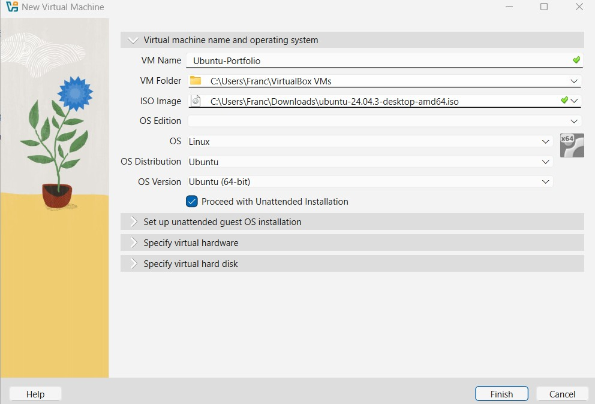
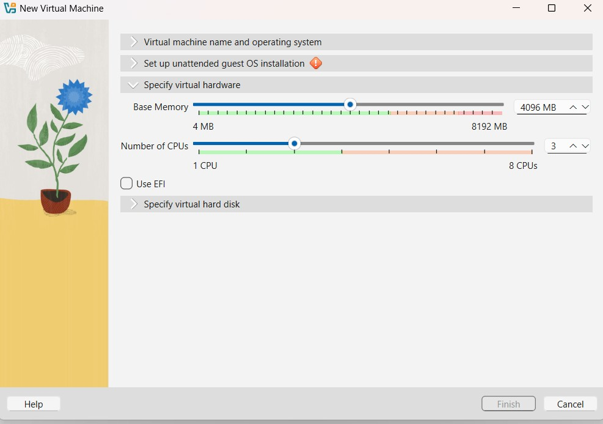
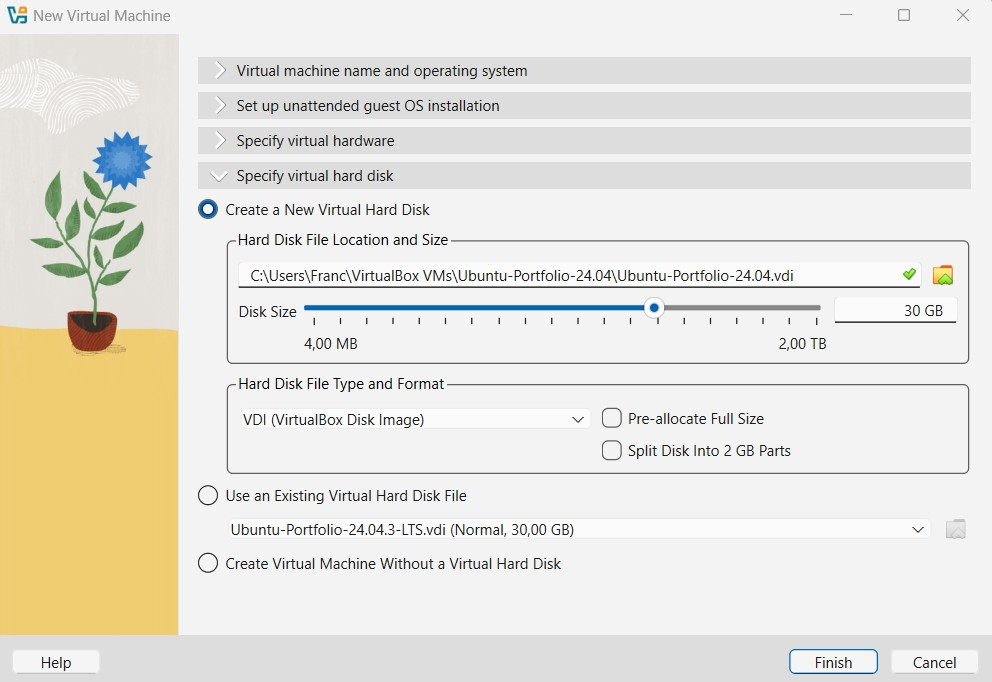
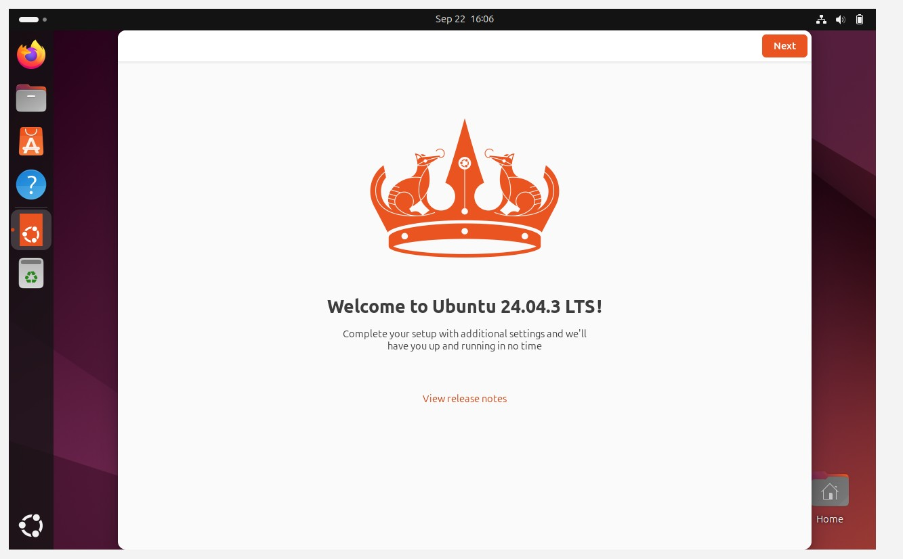
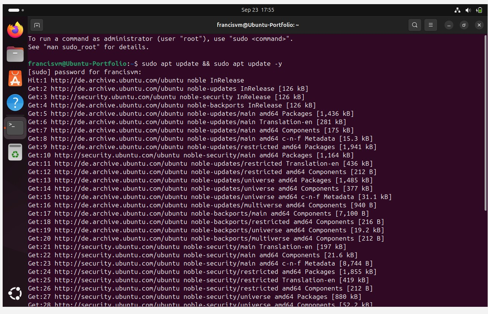

# Project 01 – Virtual Machine & Webserver Setup

## Overview
In this project, I set up a virtualized environment using VirtualBox and Ubuntu to host a simple web server.  
The goal was to learn the basics of virtualization, system installation, networking, service configuration, and using Linux commands. 
This was my first practical lab for building cybersecurity skills after the theoretical introduction to such domains throughout my Google Cybersecurity Course.

---

## Objectives
- Install and configure a Linux virtual machine (Ubuntu).
- Set up a working web server (Apache2).
- Enable access to the web server from the host machine’s browser.
- Troubleshoot networking and firewall issues.

---

## Steps

## Phase 1 - Preparation of the environment – VM & OS Installation


#### Steps

1. **Download VirtualBox**
   - Downloaded VirtualBox version **7.2.2** from the official website.
   - Selected the **Windows package** for installation.

2. **Download Ubuntu ISO**
   - Downloaded **Ubuntu 24.04.3 LTS** ISO file from the official Ubuntu website.

3. **Install VirtualBox**
   - Installed VirtualBox on my local hard drive.

4. **Create New Virtual Machine**
   - Named the VM **“Ubuntu-Portfolio”**.
   - Selected Ubuntu as the guest OS.



5. **Configure Virtual Hardware**
   - Set **Base Memory** to **4096 MB**.
   - Allocated **3 CPUs**.
   - *Note:* This configuration balances performance and stability:
     - 4 GB RAM is enough for Ubuntu desktop while leaving resources for the host.
     - 3 CPUs gives the VM responsiveness without overloading the host.



6. **Create Virtual Hard Disk**
   - Created a new virtual disk of **30 GB** in VDI format.




7. **Start Installation & User Setup**
   - Booted the VM with the Ubuntu ISO.
   - Followed installation steps:
     - Language, region, disk setup.
     - Created a **username and password** for login.

8. **Successful Boot**
   - The VM started successfully with Ubuntu 24.04.3 LTS installed.
   - Logged in with the created user account.
   - 


Note: All screenshots of this process can be found [here](./Screenshots).

---


## Phase 2 – System Preparation & Services

In this phase, I prepared the Ubuntu system with updates, checked the OS version, configured a firewall (UFW), and installed/configured the Apache web server.

---

### 1. System Updates

I started by making sure the VM was fully updated:

- Ran the update and upgrade commands:
  ```bash
  sudo apt update && sudo apt upgrade -y

  

- Checked for remaining upgradable packages:

   ```bash
   sudo apt list --upgradable


At first, some packages were held back because of phased updates (Ubuntu only releases some updates gradually).
- To force all updates, I used:


   ```bash
   sudo apt -o APT::Get::Always-Include-Phased-Updates=true full-upgrade -y
   ```

After that, ```apt list --upgradable ``` returned no pending updates, meaning the system was up to date.
- I also checked the distribution version with:


   ```bash
   lsb_release -a
   ```

- Verified that the system was up-to-date and I'm operating with the newest version.

(por que é importante...)

### 2. Firewall Configuration

- To secure the VM, I installed UFW (Uncomplicated Firewall):

   ```bash
   sudo apt install ufw -y
   ```

- Then I enabled it:

   ```bash
   sudo ufw enable
   ```

- And confirmed it was active:

   ```bash
   sudo ufw status
   ```
   
At first, I made a mistake by trying to allow OpenSSH (this returned an error).

- I corrected it with:

   ```bash
   sudo ufw allow ssh
   ```
   
However, this rule allows SSH from any IP.
- Since I want to follow security best practices, I restricted SSH access only to my host machine by adding its IPv4 address (192.168.178.21):

   ```bash
   sudo ufw allow from 192.168.178.21 to any port 22
   ```

- After that, I removed the generic SSH rule so only the host-specific rule remained active.

  ```
  sudo ufw delete allow 22/tcp
  ```


  
(é importante porque...)


