# Project 01 – Virtual Machine & Webserver Setup

## Overview
In this project, I set up a virtualized environment using VirtualBox and Ubuntu to host a simple web server.  
The goal was to learn the basics of virtualization, system installation, networking, service configuration, and using Linux commands. 
This was my first practical lab for building cybersecurity skills after the theoretical introduction to such domains throughout my Google Cybersecurity Course.

---

## Objectives
- Install and configure a Linux virtual machine (Ubuntu).
- Set up a working web server (Apache2).
- Enable access to the web server from the host machine’s browser.
- Troubleshoot networking and firewall issues.

---

# Phase 1 - Preparation of the environment – VM & OS Installation

## Steps

1. **Download VirtualBox**
   - Downloaded VirtualBox version **7.2.2** from the official website.
   - Selected the **Windows package** for installation.

2. **Download Ubuntu ISO**
   - Downloaded **Ubuntu 24.04.3 LTS** ISO file from the official Ubuntu website.

3. **Install VirtualBox**
   - Installed VirtualBox on my local hard drive.

4. **Create New Virtual Machine**
   - Named the VM **“Ubuntu-Portfolio”**.
   - Selected Ubuntu as the guest OS.


5. **Configure Virtual Hardware**
   - Set **Base Memory** to **4096 MB**.
   - Allocated **3 CPUs**.
   - *Note:* This configuration balances performance and stability:
     - 4 GB RAM is enough for Ubuntu desktop while leaving resources for the host.
     - 3 CPUs gives the VM responsiveness without overloading the host.


6. **Create Virtual Hard Disk**
   - Created a new virtual disk of **30 GB** in VDI format.


7. **Start Installation & User Setup**
   - Booted the VM with the Ubuntu ISO.
   - Followed installation steps.
   - Created a **username and password** for login.

8. **Successful Boot**
   - The VM started successfully with Ubuntu 24.04.3 LTS installed.
   - Logged in with the created user account.


Note: All screenshots of this process can be found [here](./Screenshots).

---


# Phase 2 – System Preparation & Services

In this phase, I prepared the Ubuntu system with updates, checked the OS version, configured a firewall (UFW), and installed/configured the Apache web server.

---
# Steps

## 1. System Updates

I started by making sure the VM was fully updated:

Ran the update and upgrade commands:

  ```bash
  sudo apt update && sudo apt upgrade -y
   ```

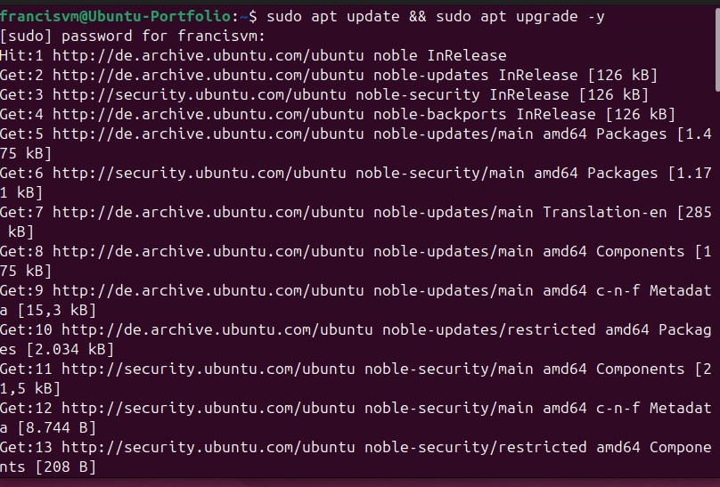

Checked for remaining upgradable packages:

   ```bash
   sudo apt list --upgradable
   ```

At first, some packages were held back because of phased updates (Ubuntu only releases some updates gradually).

To force all updates, I used:


   ```bash
   sudo apt -o APT::Get::Always-Include-Phased-Updates=true full-upgrade -y
   ```

After that, ```apt list --upgradable ``` returned no pending updates, meaning the system was up to date.

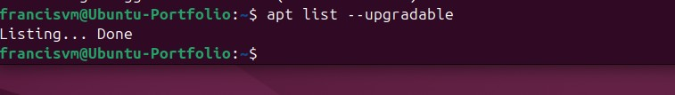


I also checked the distribution version with:


   ```bash
   lsb_release -a
   ```

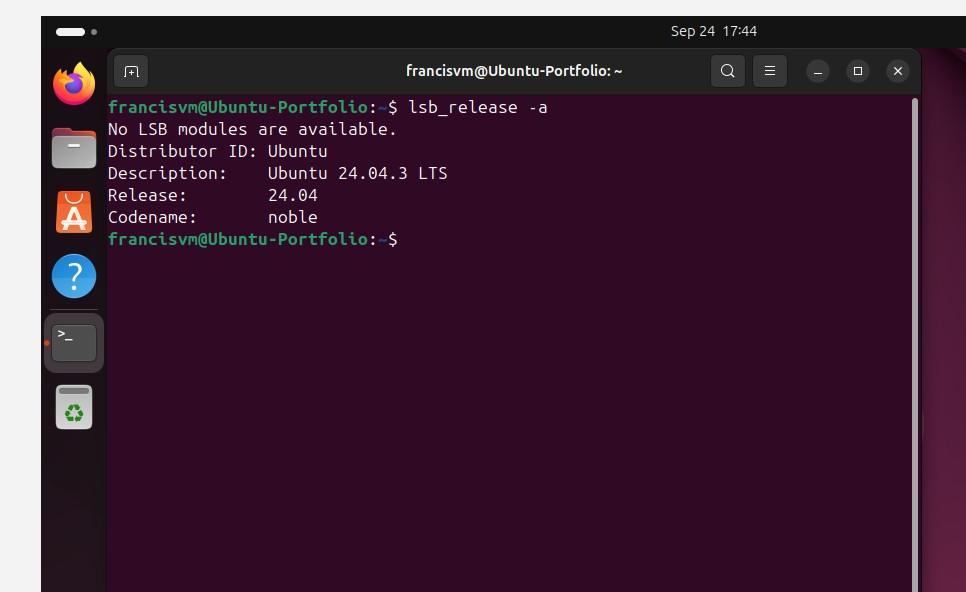

I checked the system version using `lsb_release -a` to document which Linux distribution and release I was working on.  
This ensures compatibility when installing packages and helps maintain accurate records of the environment setup.


## 2. Firewall Configuration
---

To secure the VM, I installed UFW (Uncomplicated Firewall):

   ```bash
   sudo apt install ufw -y
   ```

Then I enabled it:

   ```bash
   sudo ufw enable
   ```

And confirmed it was active:

   ```bash
   sudo ufw status
   ```
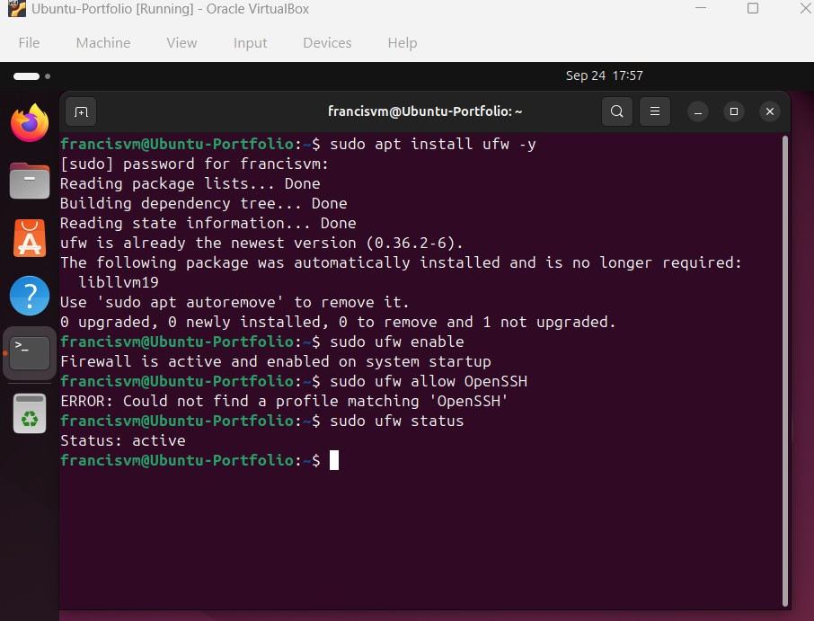


At first, I made a mistake by typing wrong - **OpenSSH (this returned an error)**.

I corrected it with:

   ```bash
   sudo ufw allow ssh
   ```

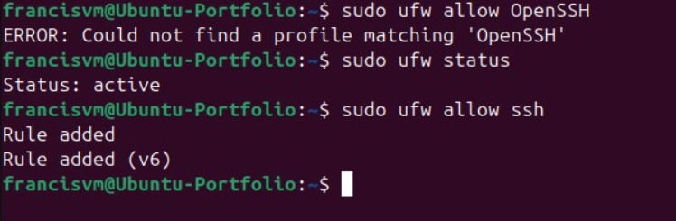


However, this rule allows SSH from any IP.
Since I want to follow security best practices, I restricted SSH access only to my host machine by adding its IPv4 address (192.168.178.21):

   ```bash
   sudo ufw allow from 192.168.178.21 to any port 22
   ```

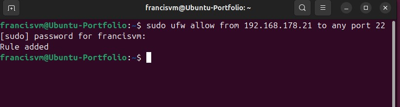


After that, I removed the generic SSH rule so only the host-specific rule remained active.

  ```
  sudo ufw delete allow 22/tcp
  ```

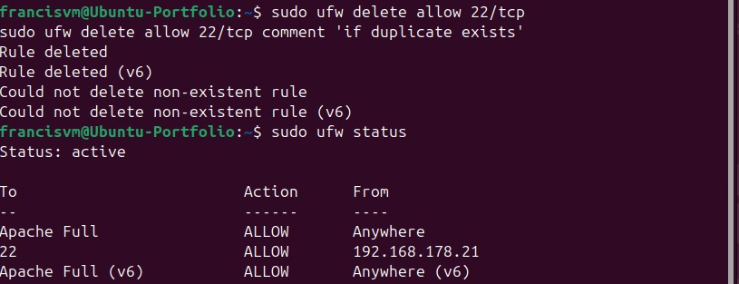

  
Restricting SSH access to a specific IP is a key security measure.  
By default, allowing SSH from "anywhere" exposes the VM to potential brute-force or unauthorized login attempts if it’s ever connected to a broader network.  
Limiting access only to my host machine (192.168.178.21) ensures that remote connections are accepted exclusively from a trusted source, greatly reducing the attack surface.


## 3.  Apache2 Installation and Configuration
---

After configuring the VM's Firewall, I proceeded to install **Apache2**.

   ```bash
   sudo apt install apache2 -y
   ```

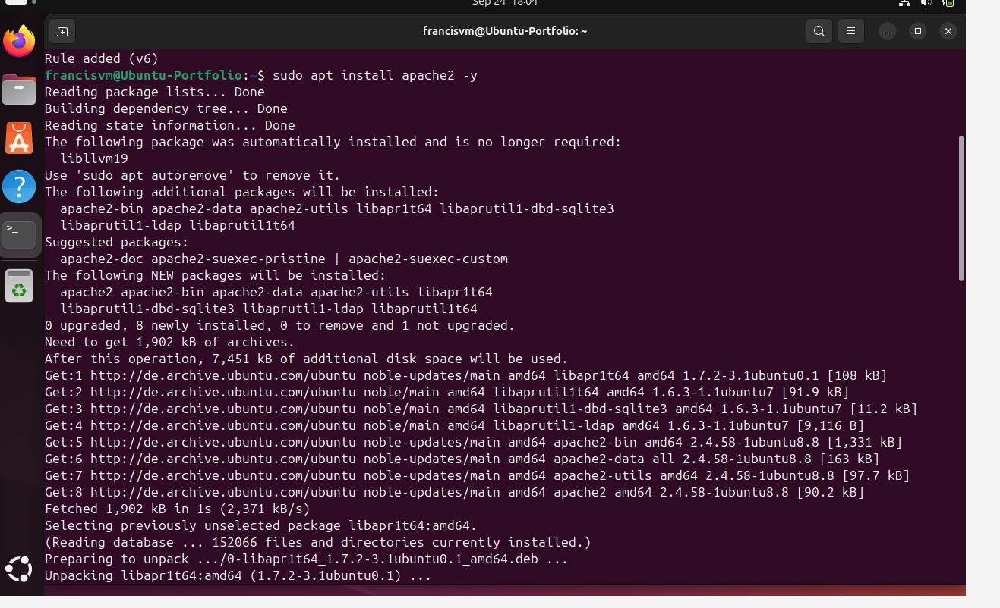

This command installs the Apache HTTP Server along with its dependencies (`apache2-bin`, `apache2-utils`, etc.).


After installation I checked if Apache2 is active and running.  
The output showed:

   - **Active: active (running)**


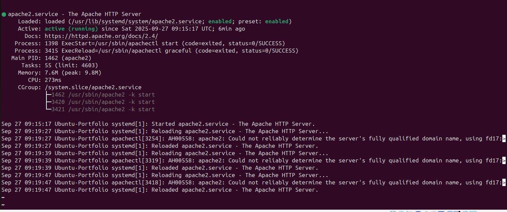

---

### Warning Message: ServerName Not Defined

However, a warning message was also in the output:

> “Could not reliably determine the server's fully qualified domain name.”


This happened because Apache didn't have a defined server name.

To resolve this, I created a new configuration file called **`servername.conf`** inside `/etc/apache2/conf-available/`.  
Then I set the **ServerName** to `localhost`.

Afterwards, I activated the configuration of the file I just created and reloaded Apache.  
This applied the alterations without the need to restart the service.

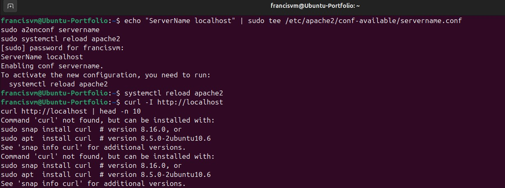

---

### Confirming Apache is responding

To confirm that Apache was responding correctly, I opened my browser inside the host machine and visited:

`http://localhost`

The default Ubuntu Apache page appeared, showing the message:

**“It works!”**

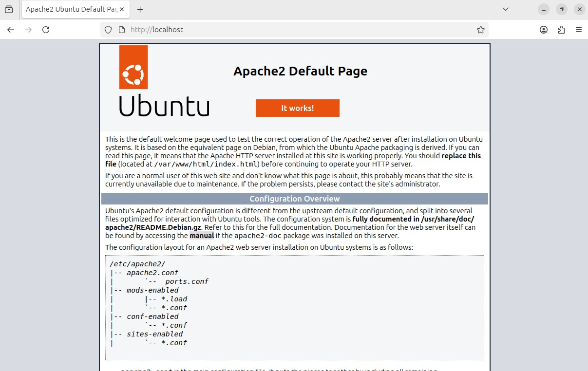

This confirmed that the server was successfully running and responding with web content.

---

### Testing Apache with cURL

After confirming in the browser that Apache was running and displaying the default page,  I also tested it using **cURL** to verify that the server was correctly responding to HTTP requests.  
This allowed me to check the response headers and confirm that Apache was serving web content as expected.

I tested Apache using:

   ```bash
   curl -I http://localhost
   ```

The first time I tested it, the output contained the message:

   > **Command 'curl' not found**

This happened because the **cURL** (command line tool to access websites) wasn’t installed yet.


---

### Installing cURL

To install cURL I followed the instructions provided by the terminal and **cURL was successfully installed** using the system’s package manager (`apt`).  
This confirmed that the utility was added correctly and is now available for HTTP request testing.

I installed the program using:

 ```bash
 sudo snap install curl  # version 8.16.0, or
 sudo apt install curl   # version 8.5.0-2ubuntu10.6
 ```

**cURL** was then added to my system.

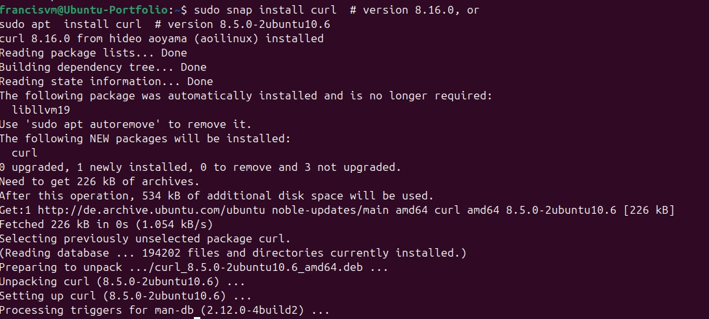

---

### Testing Apache Again

After installing cURL successfully, I tried to test if I could reach Apache again:

   ```bash
   curl -I http://localhost
   ```

The output was:

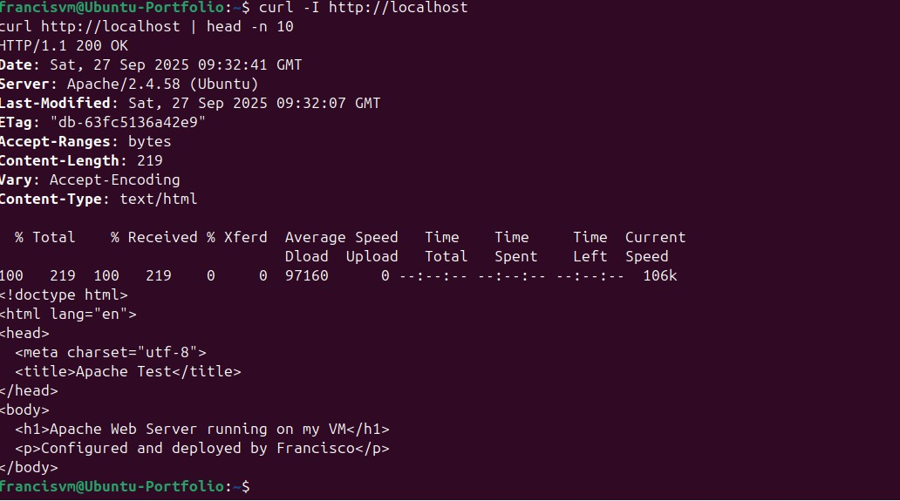


This means:

- The server is online and answering to the HTTP protocol (port 80).
- The code 200 OK indicates that the page was found and served successfully.
- The server header shows that Apache is answering correctly.

---

### Final Verification via Browser

After applying all configurations (including setting the `ServerName` and deploying my custom HTML page),  I reopened the browser and visited `http://localhost` again.

The page displayed my personalized content:

> **Apache Web Server running on my VM**  
> **Configured and deployed by Francisco**

This confirmed that:

- Apache was still running and responding after configuration changes.  
- The new `ServerName` directive was applied successfully.  
- The web server was serving the customized HTML content correctly.

This step served as a final visual check that the Apache installation and configuration were completed successfully.

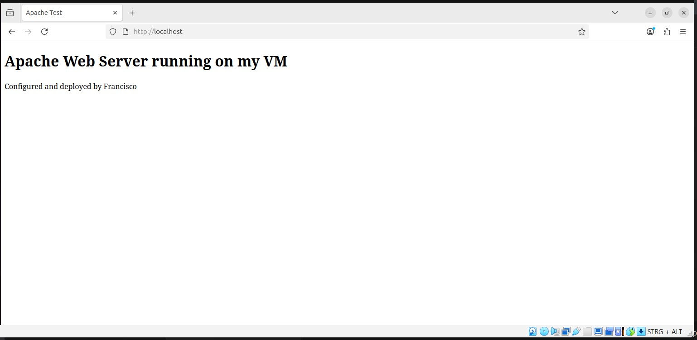


## 4.  Network Configuration and Host Access (Port Forwarding + Firewall)

After confirming that Apache was running inside the VM,  the next step was to make the web server accessible **from the host machine** (Windows) instead of only from the browser inside the VM.

---

### Network Setup (NAT and Port Forwarding)


In VirtualBox, I enabled the **Network Adapter** and attached it to **NAT** mode.  
Then I created a **Port Forwarding Rule** for Apache:

| Name   | Protocol | Host Port | Guest Port |
|--------|-----------|------------|-------------|
| Apache | TCP       | 8080       | 80          |

This means:
- Any request to **localhost:8080** on the host will be forwarded to **port 80** inside the VM.  
- Port 80 is where Apache listens by default.

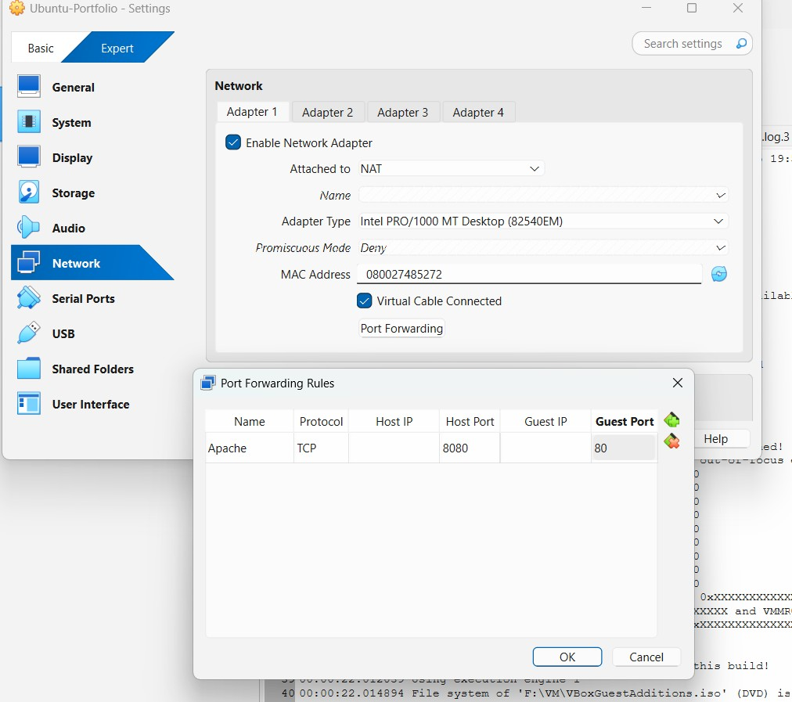

---

### Allowing Apache Access from Host IP

To enable secure access, I configured the firewall to allow traffic on ports 80 and 443 only from my host IP address (192.168.178.21).  

This ensured that:
- The Apache server is reachable from the host machine.  
- No other devices on the local network can access the server.
I choose to restrict access on my local network as a way of demonstrating security best practices.

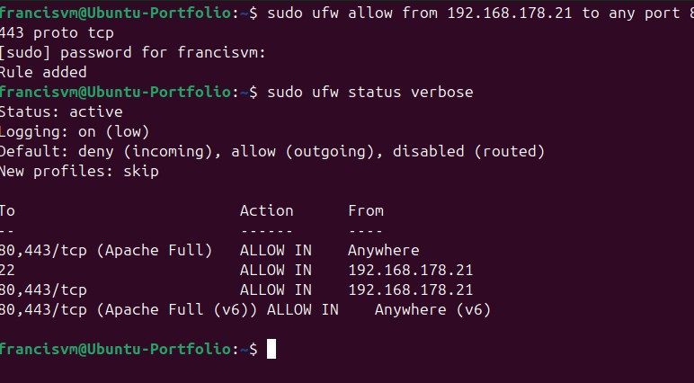

---

### Test - Access from Host

After all set up, I loaded the page on the browser of my host machine and visited:

`http://localhost:8080`

The page loaded successfully, displaying my custom HTML message:

   >**Apache Web Server running on my VM**  
   >*Configured and deployed by Francisco*

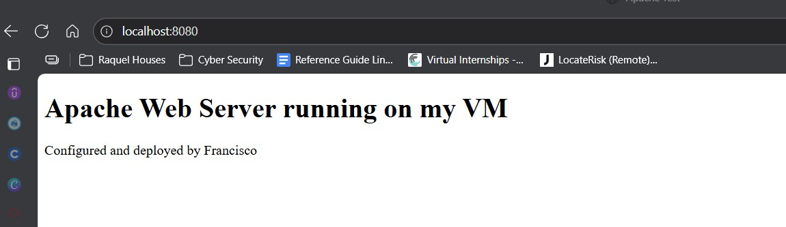

---

##  Final Security Adjustment

After verifying that Apache and SSH were working correctly,  I refined the firewall configuration by deleting the general `Apache Full` rule.  
Now, only ports **22** (SSH) and **80/443** (HTTP/HTTPS) are open and access is restricted exclusively to my host machine’s IP (**192.168.178.21**).  

   - This ensures minimal exposure while keeping remote management and web access functional for testing.


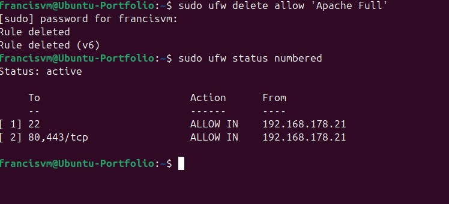


Note: All screenshots of this process can be found [here](./Screenshots).


---

### Conclusion

This confirmed that:

- The **port forwarding** rule in VirtualBox was configured correctly.  
- The **UFW firewall** allows access only from my host IP for better security.  
- Apache was successfully reachable from the host browser through `localhost:8080`.  
- The web server is now fully functional and safely accessible from the host system.


